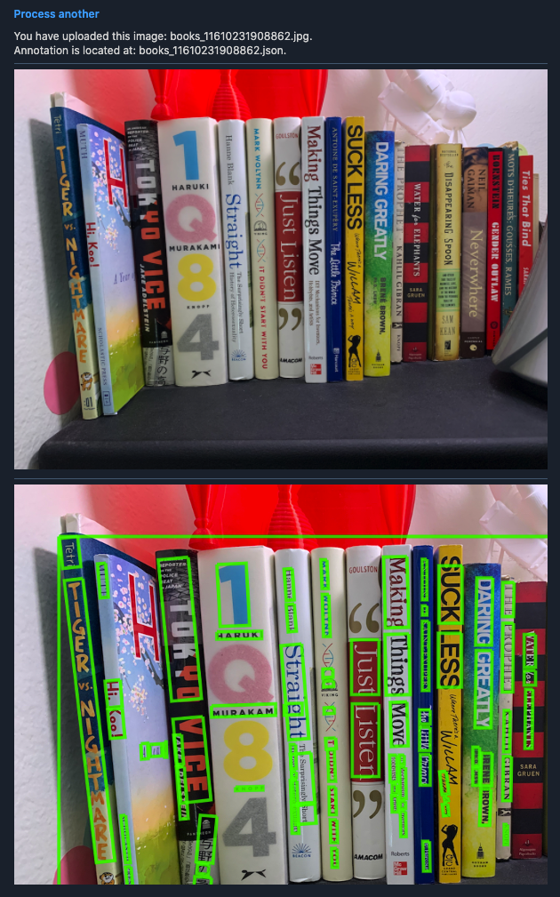

#  Bookie - an INT 2.2 project

An app that aims to help users quickly catalog, check prices for resale, donation, etc in one shot. Take a photo of your bookshelves and Bookie will grab title/author information using Google's Cloud Vision API and return additional metadata and check their current resale value.

### WIP

## Credits
Google Cloud Vision API = https://cloud.google.com/vision/docs
Water.css - https://watercss.kognise.dev/
